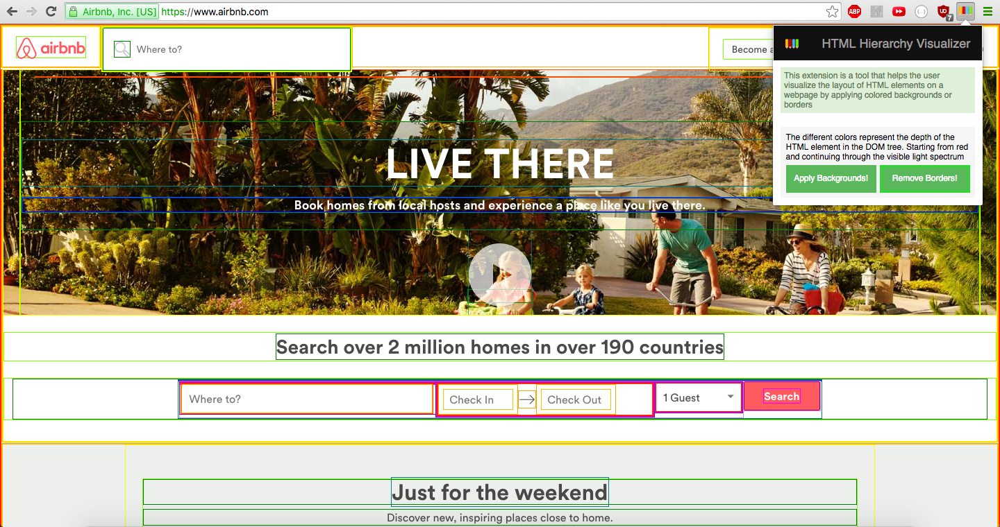
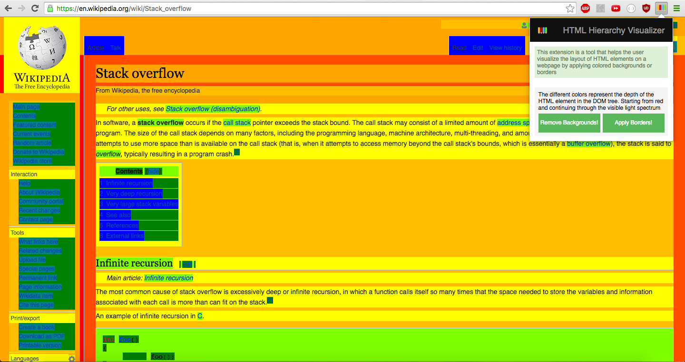

# HTML Hierarchy Visualizer

[Chrome Webstore Link][webstore]

HTML Hierarchy Visualizer is a chrome extension that enables users to toggle backgrounds and borders are HTML elements on the webpage
to get a sense of how the page was designed. It is written in pure Javascript.

## Features
* Add or remove colored borders around HTML elements at the click of a button

* Add or remove colored backgrounds around HTML elements at the click of a button


## Implementation
HTML Hierarchy Visualizer combines HTML, CSS and Javascript.

* Executes different scripts depending on the DOM element pressed by the user
```javascript
function handleBackgroundClick() {
  if (displayBackground) {
    displayBackground = false;
    document.getElementById("Background").innerHTML = "Apply Backgrounds!";
    chrome.tabs.query({"active": true, "currentWindow": true}, handleRemoveBackgroundScript);
  } else {
    displayBackground = true;
    document.getElementById("Background").innerHTML = "Remove Backgrounds!";
    chrome.tabs.query({"active": true, "currentWindow": true}, handleApplyBackgroundScript);
  }
}

function handleApplyBackgroundScript(tab) {
  chrome.tabs.executeScript(null, {file: "./javascript/apply_background.js"});
}

function handleRemoveBackgroundScript(tab) {
  chrome.tabs.executeScript(null, {file: "./javascript/remove_background.js"});
}
```

* Appends HTML link element to document body to apply custom styling to webpage
```javascript
var link = document.createElement('link');
link.type = 'text/css';
link.rel = 'stylesheet';
link.href = chrome.extension.getURL('../css/colors.css');
head.appendChild(link);
```

* Recursively applies a new colored background using modular arithmetic
```javascript
function applyBackground(array, depth) {

  let colors = [
    "red-background",
    "vermillion-background",
    "orange-background",
    "amber-background",
    "yellow-background",
    "chartreuse-background",
    "green-background",
    "teal-background",
    "blue-background",
    "violet-background",
    "purple-background",
    "magenta-background"
  ];

  let length = colors.length;
  depth += 1;

  for (let i = 0; i < array.length; i++) {
    array[i].className += ` ${colors[depth%length]}`;

    if (array[i].children) {
      applyBackground(array[i].children, depth);
    }
  }
}
```
[webstore]: <https://chrome.google.com/webstore/detail/html-hierarchy-visualizer/beaeppehjnnnidajcmalfcajahopihcb>
